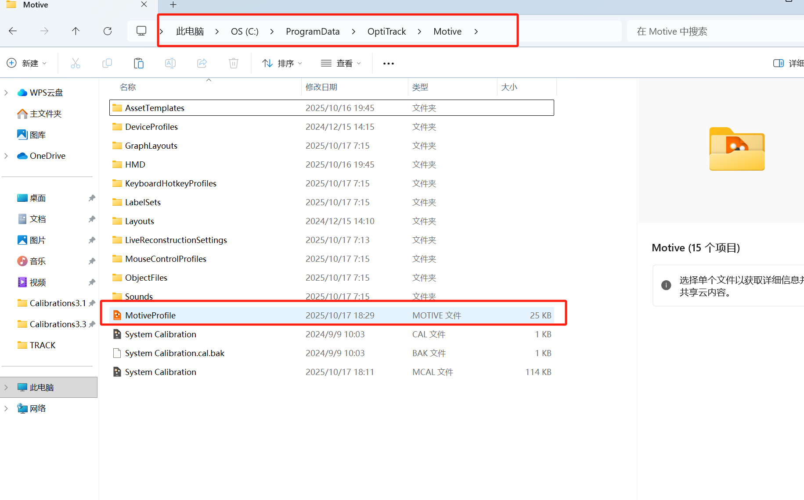
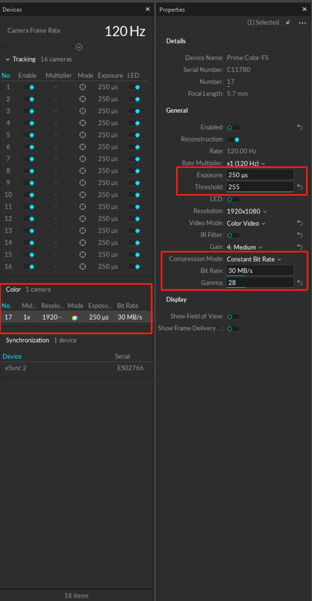

# 第6章 故障诊断手册

**版本**: V3.3.1  
**章节**: 6/6

> 本章节提供系统性的问题诊断方法和解决方案。

---

## 6.1 Motive使用问题

### 问题1：Motive软件闪退

**症状**：运行Motive时，软件立即关闭

**解决方案**：定位到目录`C:\Program Data\OptiTrack\Motive\`，找到并删除`MotiveProfile`文件，如图所示：




### 问题2：Motive中数据卡顿
**症状**：Motive软件运行时，数据更新不流畅，有明显卡顿，有间断的数据流

**解决方案**：
1. 检查电脑性能，确保CPU和内存使用率不高
2. 降低Motive彩色相机的功率占比，如图所示：



## 6.2 NatNet连接问题

### 问题1：无法连接到OptiTrack服务器

**症状**：
```
❌ 无法连接到OptiTrack服务器
请检查:
  1. Motive是否正在运行
  2. 流设置是否正确
  3. 网络连接是否正常
  4. IP地址是否正确
```

**诊断工具**：
```bash
python Scripts\Tools\diagnose_natnet_data.py
```

**解决方案**：

#### A. 检查Motive运行状态

```
Windows任务管理器 → 进程标签 → 查找"Motive"
```

- 如果不存在 → 启动Motive软件
- 如果存在但卡死 → 重启Motive

#### B. 检查网络连接

```cmd
ping 192.168.3.58

# 正常：Reply from 192.168.3.58: bytes=32 time<1ms
# 异常：Request timed out
```

- 如果超时 → 检查网线连接或WiFi
- 如果"目标主机无法访问" → 检查IP配置

#### C. 验证IP配置

**Motive端**：
```
编辑 > 设置 > 流设置 > 本地接口
记下显示的IP地址（如192.168.3.58）
```

**Python端**（`lsl_manager.py` 第77行）：
```python
self.server_ip = "192.168.3.58"  # 必须匹配Motive的IP
```

**或配置文件**（`experiment_config.json`）：
```json
"natnet_config": {
  "server_ip": "192.168.3.58"  ← 改这里
}
```

#### D. 检查防火墙

```
Windows防火墙 → 允许应用通过防火墙
确保以下程序允许：
- ✅ Motive.exe
- ✅ python.exe
```

---

### 问题2：连接成功但无数据

**症状**：
```
✅ NatNet客户端连接成功
[NatNet] 帧数: 0, FPS: 0.0, 缓存骨骼: []
```

**诊断步骤**：

#### A. 检查Motive录制状态

```
Motive底部状态栏 → 录制按钮应该是红色
```

- 如果是灰色 → 点击开始录制
- **关键**：NatNet数据只在录制时广播！

#### B. 检查流设置

```
编辑 > 设置 > 流设置（Streaming）

必须启用：
✅ Broadcast Frame Data
✅ Marker Set（如果使用Markerset）
✅ Labeled Markers
```

#### C. 检查对象存在性

```
Motive Assets面板：
应该有Sub001和Sub002对象
状态应该是绿色（正在跟踪）
```

#### D. 运行诊断工具

```bash
python Scripts\Tools\diagnose_natnet_data.py
```

查看"检测到的Markerset名称"是否包含Sub001/Sub002。

---

### 问题3：光点位置不更新⭐

**症状**：
```
[NatNet] Markerset数据: Sub001 -> 质心: (+0.932, +0.861, -0.001)
# 坐标一直不变
# PsychoPy光点静止不动
```

**最常见原因**：Sub001是**Skeleton类型**！

#### 解决方案：改为Markerset类型

```
步骤1: Motive Assets面板 → 找到Sub001
步骤2: 检查图标：
       🦴 = Skeleton（错误！） 
       📦 = Markerset（正确！）

步骤3: 如果是Skeleton：
       右键 → Delete → 删除
       
步骤4: 重新创建Markerset：
       选择标记点 → 右键 → "Create Marker Set"
       
步骤5: 重命名为"Sub001"

步骤6: 重启Python程序
```

**原理**：
```
Skeleton类型 → 要求标记符合骨骼结构
    ↓
标记贴在物体上 → 不符合骨骼模型
    ↓
Motive无法计算姿态 → 数据冻结
    ↓
Python收到的一直是旧数据 → 光点不动
```

**验证修复**：
```bash
python Scripts\Tools\test_natnet_to_psychopy.py

# 移动Sub001标记物
# 终端输出的坐标应该实时变化：
[测试] 帧30: Motive(+0.932, +0.861, -0.001) -> ...
[测试] 帧60: Motive(+1.120, +0.850, +0.320) -> ... ✅ 变化了！
```

---

## 6.3 LSL流问题

### 问题1：LSL录制器找不到流

**症状**：
```
🔍 扫描LSL数据流 (等待5秒)...
⚠️  未发现任何LSL数据流
```

**诊断步骤**：

#### A. 检查实验程序是否已启动

LSL流由实验程序创建，必须先启动实验！

```
✅ 正确顺序：
1. 启动实验程序（创建LSL流）
2. 启动LSL录制器（发现流）

❌ 错误顺序：
1. 启动LSL录制器（还没有流）→ 未发现
2. 启动实验程序（太晚了）
```

#### B. 增加扫描时间

```bash
# 从5秒增加到15秒
python Scripts\Tools\lsl_recorder.py --cli --output-dir Data --scan-timeout 15 --verbose
```

#### C. 运行测试工具

```bash
# 先启动实验
python Scripts\Tools\test_natnet_to_psychopy.py

# 新终端：测试LSL流
python Scripts\Tools\test_optitrack_lsl_streams.py

# 应该显示：
# ✅ 发现 3 个LSL流
```

#### D. 检查防火墙

```
LSL使用UDP组播：239.255.42.99:16571

Windows防火墙 → 高级设置 → 入站规则
确保允许Python.exe的UDP通信
```

---

### 问题2：LSL录制数据为空或很少

**症状**：
```
# Markers.csv有19条记录
# LSL_Recording_Navigation_Markers.csv只有1条记录
```

**原因**：录制器启动太晚，错过了前面的事件

**解决**：
```bash
# ✅ 正确流程：
# 终端1：先启动录制器
python Scripts\Tools\lsl_recorder.py --cli --output-dir Data --scan-timeout 10 --verbose

# 等待显示：
#   📡 开始接收数据...
#   ⏱️  持续录制中...

# 终端2：再启动实验
python run_experiment.py

# 现在所有marker都会被录制！
```

---

### 问题3：LSL数据保存失败（按ESC后无文件）

**症状**：
```
实验中按ESC退出 → Data/LSL/目录为空
```

**V3.3.1已修复**！

**新特性**：
- ✅ 每30秒自动保存
- ✅ 按ESC不影响（录制器继续运行）
- ✅ atexit紧急保存

**验证**：
```bash
# 启动录制器
python Scripts\Tools\lsl_recorder.py --cli --output-dir Data --verbose

# 应该每30秒看到：
#   💾 自动保存#1: 3600样本已保存

# 即使按ESC退出实验，数据也已保存！
```

**如果仍然失败**：
```
检查：
1. 录制器终端是否显示"开始接收数据"
2. 样本数是否在增长
3. 自动保存提示是否出现
4. 检查Data/LSL/目录权限
```

---

## 6.4 PsychoPy显示问题

### 问题1：窗口中看不到文本

**症状**：
```
# 窗口中只有光点和边框
# 没有青色/黄色文本显示
```

**原因**：文本位置超出窗口范围

**解决**（test_natnet_to_psychopy.py）：
```python
# 调整文本位置（第92, 103行）
self.motive_text_stim.pos = (-700, 400)    # 左上角
self.psychopy_text_stim.pos = (700, 400)   # 右上角
self.status_text_stim.pos = (0, -450)      # 底部

# 如果还是看不到，改为窗口中心测试：
self.motive_text_stim.pos = (0, 0)
```

---

### 问题2：窗口卡顿

**症状**：
```
PsychoPy窗口帧率<20 FPS
光点移动不流畅
```

**原因**：每帧创建新对象（已在V3.3修复）

**验证修复**：
```python
# map_phase.py或navigation_phase.py

# ✅ 应该在setup中创建对象
def setup(self):
    self.scene_border = visual.Rect(...)  # 创建一次

# ✅ 在循环中只绘制
def draw_scene(self):
    self.scene_border.draw()  # 重复使用
```

**进一步优化**：
```python
# 降低帧率（test_natnet_to_psychopy.py 第289行）
time.sleep(1/20)  # 从30 FPS降到20 FPS
```

---

## 6.5 数据保存问题

### 问题1：Behavior.csv某些字段为空

**症状**：
```csv
...,Time_Wall_go,Time_Wall_arrive,RT_WallMarker,...
...,,,,29.5,...
```

**原因分析**：

#### 原因A：字段名不匹配（V3.3.1已修复）

**检查代码**（map_phase.py 第489-501行）：
```python
# ✅ 应该是：
trial_data['Time_Wall_arrive'] = ...  # 首字母大写
trial_data['RT_WallMarker'] = ...

# ❌ 如果是小写就错了：
trial_data['time_wall_arrive'] = ...  # 错误
```

#### 原因B：任务未完成（正常）

**如果参与者没有到达墙标**：
- Time_Wall_arrive：无数据（正常）
- RT_WallMarker：无数据（正常）

**这是预期行为！** 只有完成的步骤才记录时间。

### 问题2：Position.csv数据量很小

**症状**：
```
Position.csv只有几百行（正常应该几万行）
```

**原因**：
- 实验时间很短
- 位置数据丢失
- buffer未及时刷新

**解决**：
```python
# 检查buffer设置（data_logger.py）
position_buffer_size = 100  # 每100帧写入一次

# 检查flush调用（data_logger.py）
def close(self):
    self.flush_position_buffer()  # 确保最后flush
```

---

## 6.6 性能问题

### 问题1：CPU占用过高

**症状**：
```
CPU占用>70%
电脑发热明显
```

**解决方案**：

#### 方案A：降低PsychoPy帧率

```python
# test_natnet_to_psychopy.py 或 Procedures/
time.sleep(1/20)  # 从30降到20 FPS
```

#### 方案B：减少调试输出

```python
# lsl_manager.py
if self.frame_count % 300 == 1:  # 从120改为300（减少打印）
    print(...)
```

#### 方案C：关闭不必要的流

```python
# 禁用位置LSL广播（如果不需要）
lsl_manager.start_services(enable_position_broadcast=False)
```

### 问题2：内存占用持续增长

**症状**：
```
运行一段时间后内存占用>500MB
```

**原因**：LSL录制器buffer未清理（V3.3.1已修复）

**验证修复**（lsl_recorder.py第303-304行）：
```python
# ✅ 应该有buffer清空
self.data_buffers = {stream_name: [] for stream_name in self.data_buffers.keys()}
```

---

## 6.6 常见问题FAQ

### Q1: 为什么Sub001不更新但Sub002更新？

**A**: Sub001可能是Skeleton类型，改为Markerset即可。

详见 [6.1问题3](#问题3光点位置不更新⭐)

---

### Q2: Navigation_Markers需要录制吗？

**A**: 不需要！Markers.csv已经包含更详细的信息。

LSL录制器默认不勾选Navigation_Markers流。

---

### Q3: 如何修改缩放因子？

**A**: 编辑`Config/experiment_config.json`第6行：
```json
"scale_factor": 200.0  ← 改这个数字
```

保存后重启程序即可。

详见 [第4章 4.1节](技术文档-第4章-配置参数.md#41-坐标转换参数⭐)

---

### Q4: 时间戳为什么不一致？

**A**: V3.3.1已统一为LSL时钟。

所有数据现在使用`pylsl.local_clock()`，完全同步。

详见 [第5章 5.3节](技术文档-第5章-数据格式.md#53-时间戳系统)

---

### Q5: LSL录制器窗口太小？

**A**: V3.3.1已放大到1200×800像素。

如需更大，编辑`Scripts/Tools/lsl_recorder.py`第445行。

---

### Q6: 音频指令间隔太短？

**A**: 编辑`Config/experiment_config.json`：
```json
"interval_after_target_found": 3.0  ← 改为3秒
```

或修改代码（map_phase.py第602行）：
```python
time.sleep(3.0)
```

---

### Q7: 按ESC退出后LSL数据丢失？

**A**: V3.3.1已修复！

现在有定期自动保存（每30秒）+ 紧急保存，数据99.9%可靠。

详见 [6.3问题3](#问题3lsl数据保存失败按esc后无文件)

---

### Q8: 如何只录制某个Sub的位置？

**A**: 修改启动参数：
```python
# lsl_manager.py
lsl_manager.start_services(
    enable_position_broadcast=True,
    sub_ids=['001']  # 只广播Sub001
)
```

或CLI录制器：
```bash
python Scripts\Tools\lsl_recorder.py --cli --output-dir Data --streams 2 --verbose
# 只录制流2（假设是Sub001_Position）
```

---

### Q9: 数据采样率不是120Hz？

**A**: 实际采样率受多种因素影响：

- NatNet帧率：通常100-120 Hz（受Motive相机帧率影响）
- 网络延迟：可能丢帧
- Python处理速度：偶尔跳帧

**正常范围**：100-120 Hz  
**如果<80 Hz**：检查网络和CPU负载

---

### Q10: 如何验证数据完整性？

**A**: 使用检查脚本：

```python
# 见第5章 5.5节的check_data_integrity()函数
python -c "from check_integrity import *; check_data_integrity(1, 2)"
```

或手动检查：
```bash
# 检查文件行数
type Data\Behavior\D001\*.Behavior.csv | find /c /v ""   # 应该=trials数
type Data\Behavior\D001\*.Position.csv | find /c /v ""   # 应该>100,000
type Data\LSL\*Sub001*.csv | find /c /v ""               # 应该>100,000
```

---

## 6.7 诊断工具使用

### 工具1：NatNet数据诊断

```bash
python Scripts\Tools\diagnose_natnet_data.py
```

**输出内容**：
- 接收到的所有Markerset名称
- 接收到的所有Skeleton名称  
- 接收到的RigidBody数量
- 数据结构详细信息

**用于诊断**：
- Markerset/Skeleton类型问题
- 对象命名问题
- 数据结构访问问题

---

### 工具2：LSL流测试

```bash
python Scripts\Tools\test_optitrack_lsl_streams.py
```

**输出内容**：
- 发现的所有LSL流
- 位置流数据接收测试
- 采样率统计

**用于诊断**：
- LSL流创建问题
- 流发现问题
- 数据接收问题

---

### 工具3：NatNet→PsychoPy完整测试

```bash
python Scripts\Tools\test_natnet_to_psychopy.py
```

**功能**：
- NatNet连接测试
- 数据接收测试
- 坐标转换测试
- PsychoPy显示测试

**用于诊断**：
- 端到端数据流问题
- 显示问题
- 性能问题

---

### 工具4：LSL连接诊断

```bash
python Scripts\Tools\test_lsl_connection.py
```

**功能**：
- LSL流扫描
- NatNet连接测试
- LSL Marker发送测试
- 实时坐标转换预览

---


## 📚 技术文档完成

恭喜！您已完成所有6章技术文档的学习。

### 文档回顾

- ✅ **第1章**：项目架构 - 整体框架
- ✅ **第2章**：NatNet系统 - 数据采集
- ✅ **第3章**：LSL系统 - 数据流技术  
- ✅ **第4章**：配置参数 - 系统调优
- ✅ **第5章**：数据格式 - 分析方法
- ✅ **第6章**：故障诊断 - 问题解决

### 开始使用系统

**→ 返回 [主文档](Main.md)**

**→ 查看 [快速开始指南](README.md)**

---

**系统已完全documented！** 📚  
**Ready for Production！** 🚀

